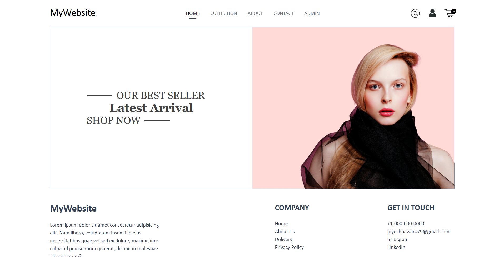
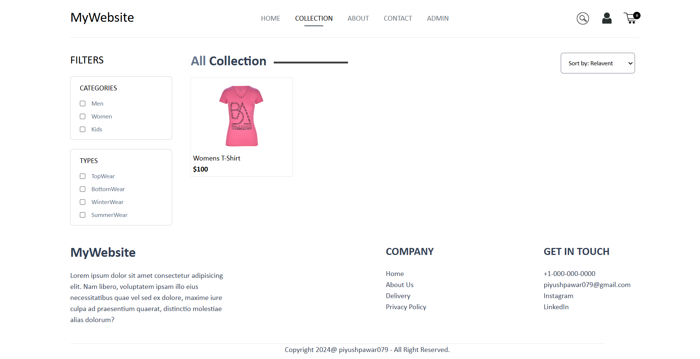
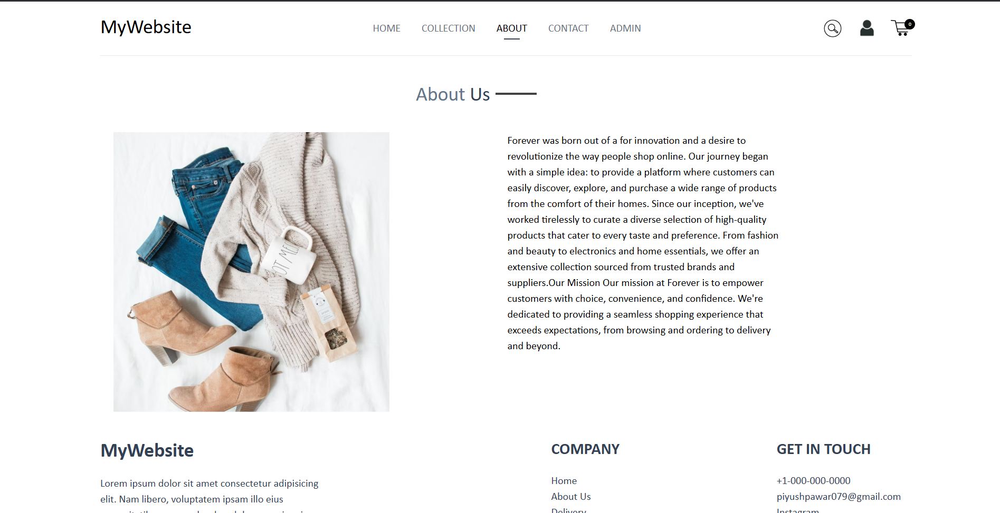
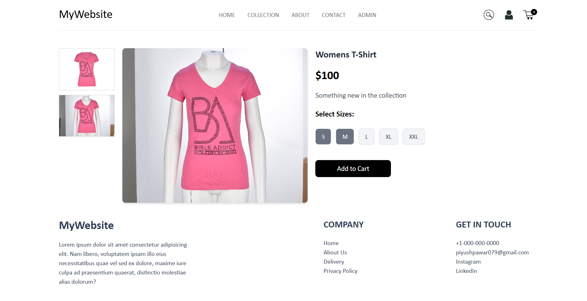
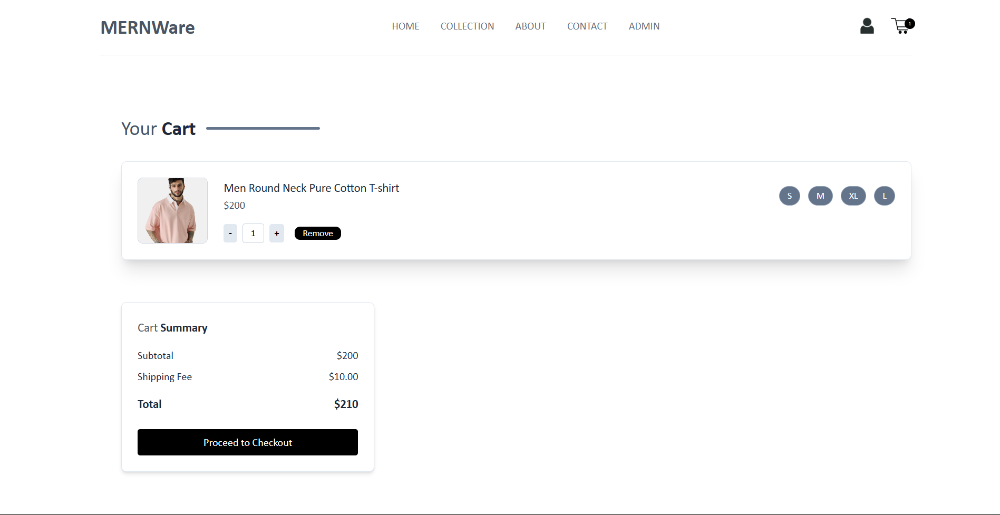
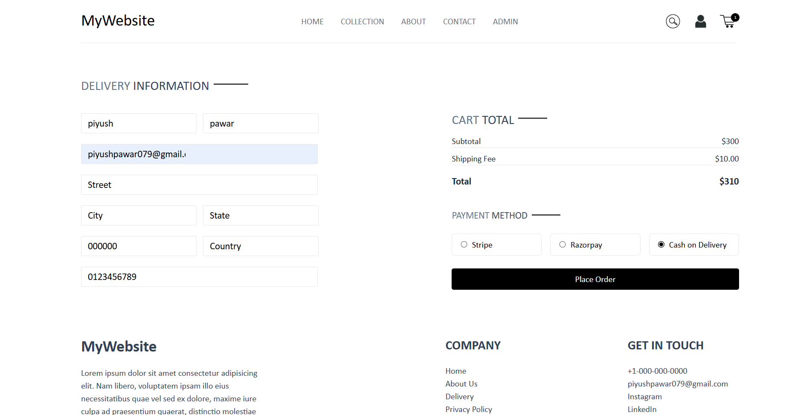
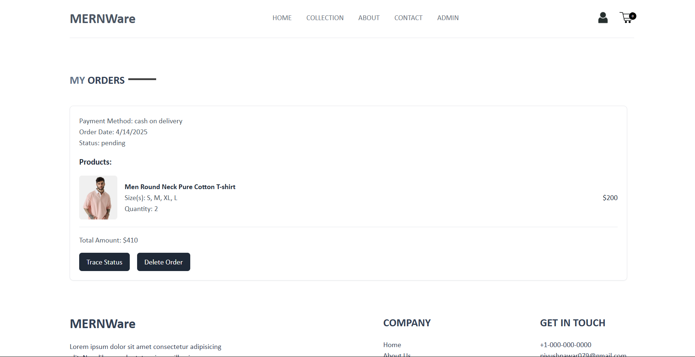
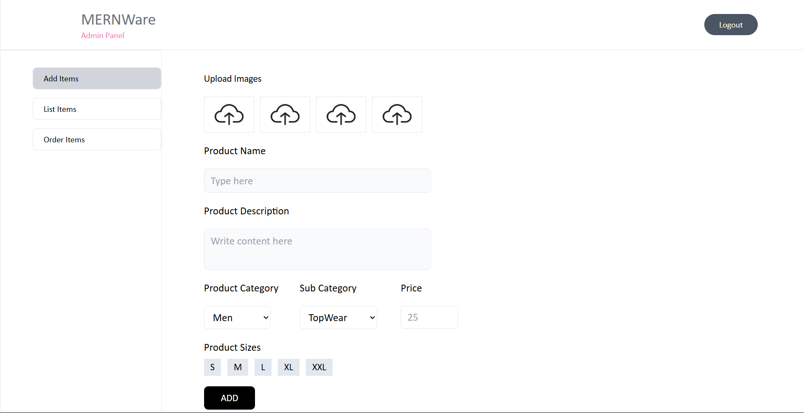
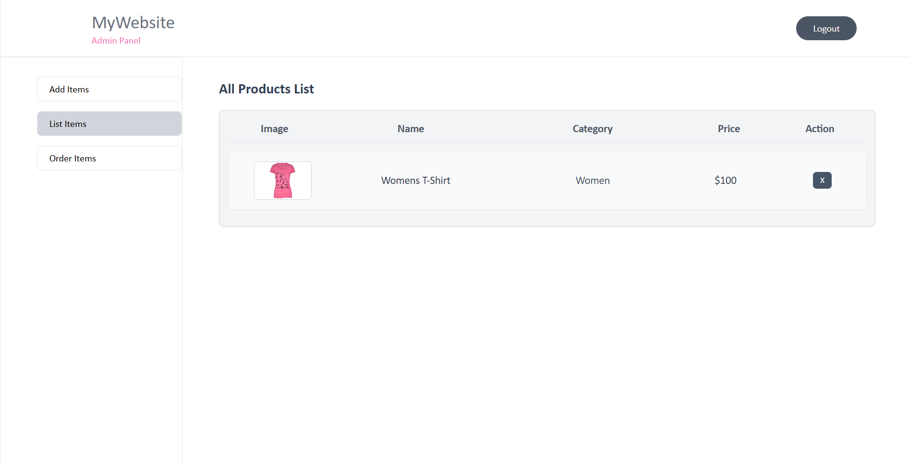
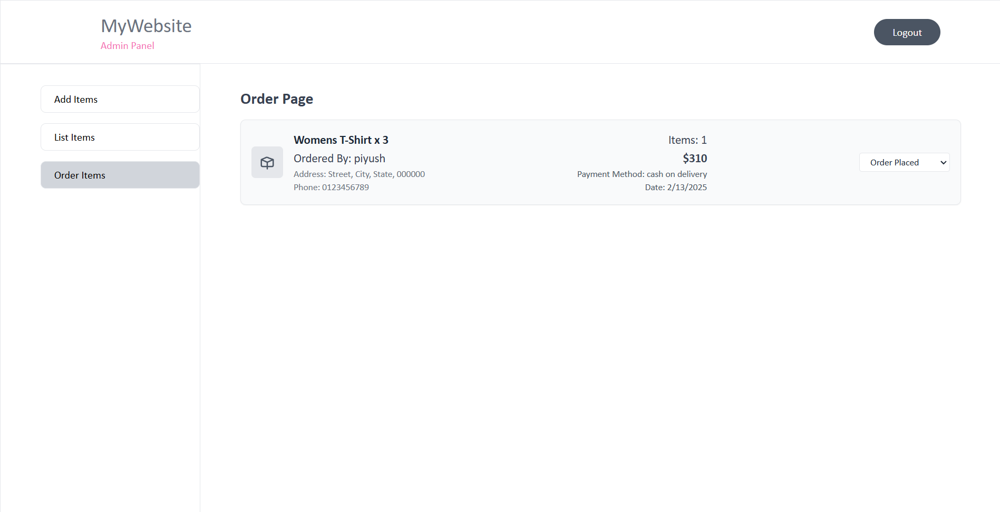

# **Live link of the website**

### https://mernware.onrender.com


# **🛍️ E-Commerce Website (MERN Stack)**  

🚀 **A fully functional e-commerce website for clothing**, built using the **MERN Stack** (MongoDB, Express.js, React.js, Node.js). The platform provides a seamless shopping experience with advanced filtering, an intuitive cart system, and a powerful **admin panel** for managing products and orders.  

## **✨ Features**  

### **🔹 User Features:**  
- **Modern UI** – A visually appealing, user-friendly design.  
- **Product Catalog** – Browse a wide range of clothing items.  
- **Advanced Filters** – Filter clothes based on **gender** and **season (Winter/Summer)**.  
- **Product Details Page** – View multiple images, descriptions, sizes, and tags for each product.  
- **Shopping Cart & Order Management** – Easily add products to the cart, select quantity, and place orders.  
- **Order Tracking** – Users can track their order status in real time.  

### **🔹 Admin Features:**  
- **Admin Panel** – Secure panel to manage products and orders.  
- **Product Management** – Add new clothes, update details, and remove existing products.  
- **Order Management** – View and change the status of orders.  
- **New Arrivals Management** – Newly uploaded clothes appear in the "New Launches" section.  

## **🛠️ Tech Stack**  
- **Frontend:** React.js (Vite)  
- **Backend:** Node.js, Express.js  
- **Database:** MongoDB  
- **State Management:** Redux  
- **Styling:** Tailwind CSS  

## **⚡ Setup Instructions**  

0. Create a .env file using the .env.sample file which is provided in the backend folder

1. Clone the Repository  
    ```sh
    git clone https://github.com/piyushpawar079/ecommerce-mern.git
    cd ecommerce-mern
    ```

2. Start the frontend
    ```sh
    cd \frontend
    npm install  
    npm run dev 
    ```

3. Start the backend
    ```sh
    #open new terminal and paste the following code
    cd \backend
    npm install
    npm start
    ```

4. Open in Browser
- Visit http://localhost:5173 to explore the e-commerce platform.

## ScreenShots

- 1. Home Page



- 2. Collections Page



- 3. AboutUs Page



- 4. Single Product Page



- 5. Cart Page



- 6. Place Order Page




- 7. View Orders Page




- 8. Admins Add Item Page




- 9. Admins Products Page




- 10. Admins View Orders Page




